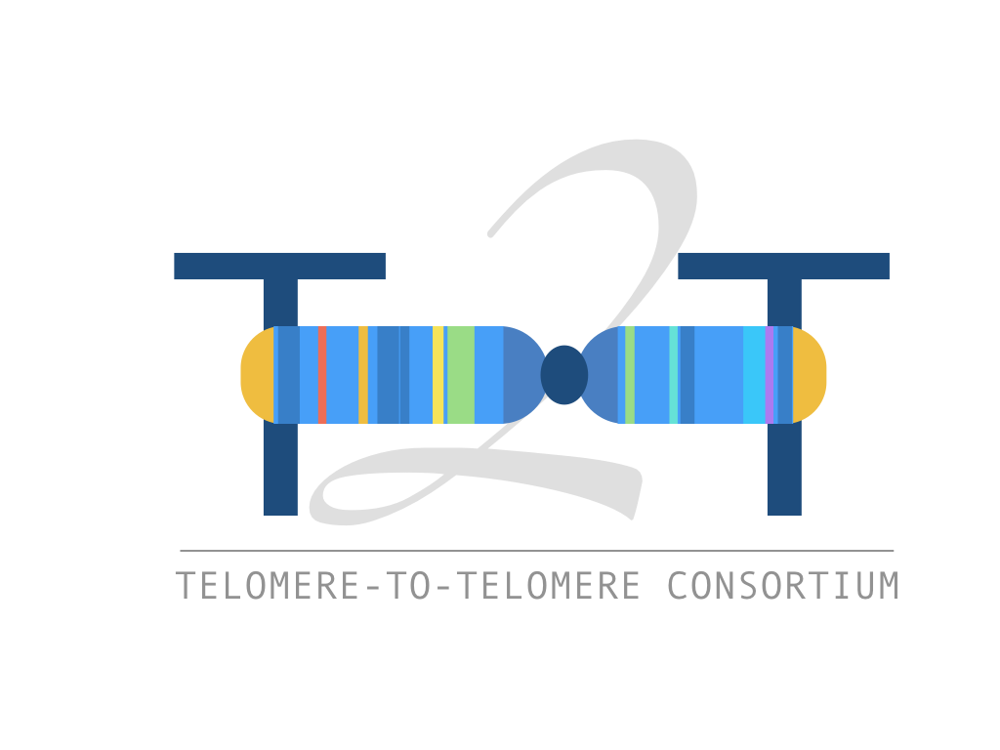

---
# You don't need to edit this file, it's empty on purpose.
# Edit theme's home layout instead if you wanna make some changes
# See: https://jekyllrb.com/docs/themes/#overriding-theme-defaults
layout: default
---

# Long Read Club

Long read club is part of a recently funded Wellcome Trust Technology Development Award. Our overall goal is to help the genomics community achieve finished quality, complete reference quality genomes routinely and at scale.

## Email list

The first rule of long read club is ... <a href="http://eepurl.com/go5sFf">sign-up for email notifications to be informed about upcoming online events!</a>. 

<!-- Begin Mailchimp Signup Form -->
<link href="//cdn-images.mailchimp.com/embedcode/classic-10_7.css" rel="stylesheet" type="text/css">

<form action="https://bham.us20.list-manage.com/subscribe/post?u=4ae68d1d9a5b44fdc7580a367&amp;id=4fac82bdc8" method="post" id="mc-embedded-subscribe-form" name="mc-embedded-subscribe-form" class="validate" target="_blank" novalidate>
    

	<h2>Subscribe</h2>

* indicates required

	<label for="mce-EMAIL">Email Address  *
</label>
	<input type="email" value="" name="EMAIL" class="required email" id="mce-EMAIL">

	<label for="mce-FNAME">First Name </label>
	<input type="text" value="" name="FNAME" class="" id="mce-FNAME">

	<label for="mce-LNAME">Last Name </label>
	<input type="text" value="" name="LNAME" class="" id="mce-LNAME">

    <strong>Preferences </strong>
    <ul><li><input type="checkbox" value="1" name="group[1433][1]" id="mce-group[1433]-1433-0"><label for="mce-group[1433]-1433-0">General notifications</label></li>
<li><input type="checkbox" value="2" name="group[1433][2]" id="mce-group[1433]-1433-1"><label for="mce-group[1433]-1433-1">Hangout notifications</label></li>
<li><input type="checkbox" value="4" name="group[1433][4]" id="mce-group[1433]-1433-2"><label for="mce-group[1433]-1433-2">Job Adverts</label></li>
</ul>

    <strong>Email Format </strong>
    <ul><li><input type="radio" value="html" name="EMAILTYPE" id="mce-EMAILTYPE-0"><label for="mce-EMAILTYPE-0">html</label></li>
<li><input type="radio" value="text" name="EMAILTYPE" id="mce-EMAILTYPE-1"><label for="mce-EMAILTYPE-1">text</label></li>
</ul>

    

        <label>Marketing Permissions</label>
        
Please select all the ways you would like to hear from Long Read Club:

        <fieldset class="mc_fieldset gdprRequired mc-field-group" name="interestgroup_field">
		<label class="checkbox subfield" for="gdpr_18617"><input type="checkbox" id="gdpr_18617" name="gdpr[18617]" value="Y" class="av-checkbox gdpr">Email </label>
        </fieldset>
        
You can unsubscribe at any time by clicking the link in the footer of our emails. For information about our privacy practices, please visit our website.

    

    

        
We use Mailchimp as our marketing platform. By clicking below to subscribe, you acknowledge that your information will be transferred to Mailchimp for processing. <a href="https://mailchimp.com/legal/" target="_blank">Learn more about Mailchimp's privacy practices here.</a>

    

	

		

		

	
    <!-- real people should not fill this in and expect good things - do not remove this or risk form bot signups-->
    
<input type="text" name="b_4ae68d1d9a5b44fdc7580a367_4fac82bdc8" tabindex="-1" value="">

    
<input type="submit" value="Subscribe" name="subscribe" id="mc-embedded-subscribe" class="button">

    

</form>

<!--End mc_embed_signup-->

## YouTube Channel

Our YouTube channel is at:

<https://www.youtube.com/c/longreadclub>

Episode 1: What is Long Read Club?

<iframe width="560" height="315" src="https://www.youtube.com/embed/lNj98pbLPPA" frameborder="0" allow="accelerometer; autoplay; encrypted-media; gyroscope; picture-in-picture" allowfullscreen></iframe>

Episode 2: DNA extraction with Jill Herschleb, 10X Genomics

<iframe width="560" height="315" src="https://www.youtube.com/embed/GlbMKds2RNc" frameborder="0" allow="accelerometer; autoplay; encrypted-media; gyroscope; picture-in-picture" allowfullscreen></iframe>

Episode 3: Whole human genome assemblies with Adam Phillippy, NHGRI

<iframe width="560" height="315" src="https://www.youtube.com/embed/W73yA4nR_Ug" frameborder="0" allow="accelerometer; autoplay; encrypted-media; gyroscope; picture-in-picture" allowfullscreen></iframe>

Episode 4: The Flye assembler with Mikhail Kolmogorov and Jeffrey Yuan, UCSD

<iframe width="560" height="315" src="https://www.youtube.com/embed/It5KXnPBnbg" frameborder="0" allow="accelerometer; autoplay; encrypted-media; gyroscope; picture-in-picture" allowfullscreen></iframe>

Episode 5: Introducing MorphoSeq: high accuracy long reads from short read platforms, Aaron Darling, Longas Technologies

<iframe width="560" height="315" src="https://www.youtube.com/embed/36Y3-ZerMCU" frameborder="0" allow="accelerometer; autoplay; encrypted-media; gyroscope; picture-in-picture" allowfullscreen></iframe>

## Protocols.io

Head over to our Protocols.io group at:

<https://www.protocols.io/groups/longreadclub>

## Datasets

This page contains links to examplar or notable long-read datasets:

### Nanopore NA12878 Consortium

The nanopore human WGS consortium are curating a regularly-updated NA12878 human cell line
data release from nanopore data. More information on their Github:

<https://github.com/nanopore-wgs-consortium/NA12878>

### Telomere-to-telomere Consortium

At AGBT 2019, the T2T consortium released an extensive dataset for the haploid human CHM13 cell
line including 50X ultra-long nanopore coverage, 10X Genomics data, BioNano data. This is
complimented by existing PacBio data. The goal of the consortium is to complete a telomere-to-telomere
contiguous finished assembly of a haploid human genome.

Find out more at their website: <https://sites.google.com/ucsc.edu/t2tworkinggroup/home>
Data release available via GitHub: <https://github.com/nanopore-wgs-consortium/CHM13>

### E. coli ultra-long read dataset

As part of protocol development, we have generated extensive ultra-long read data for 
E. coli K-12 MG1655 which is released here in case it is useful for development (e.g.
of assembly software).

